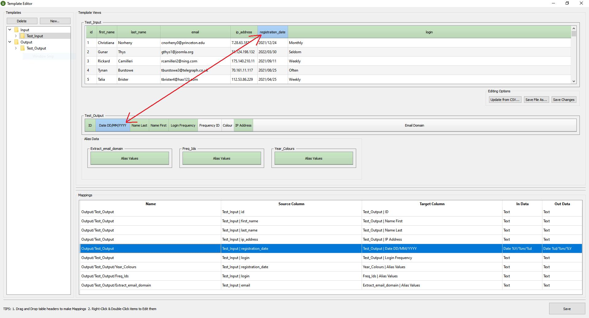
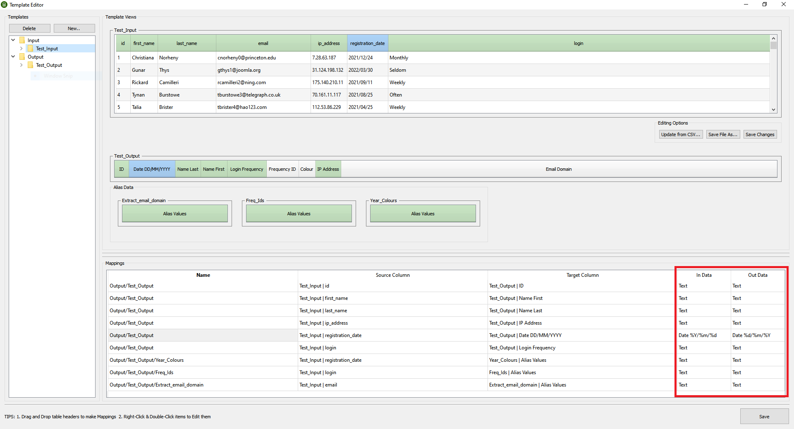
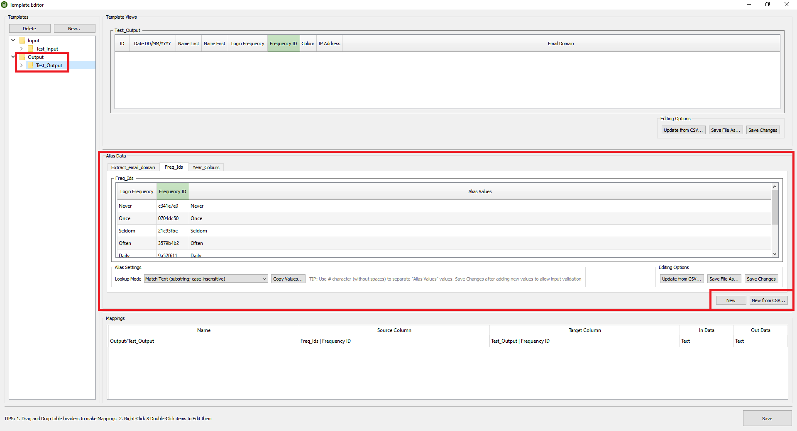

# CSV Remapper

A GUI/CLI tool for manipulating CSV file data

## Description

Allows you to remap, extract and combine data from multiple CSV sources.
Key features:
- Easy to use GUI for creating mapping Templates and processing files
- Batch-remap files using command line interface
- Combine data from multiple csv sources
- Extract data using Regex
- Omit data based on predefined values

## Getting Started

### Dependencies

* Python 3.7 or higher

### Installing

```
pip install csv-remapper
```

### Executing

Display help:
```
csv-remapper -h
```

Run in GUI mode:
```
csv-remapper
```

## Workflow

Launch `csv-remapper` in GUI mode and create an **Output Template** (Edit → New Template... → Output) by selecting a CSV file. 
This file doesn't need to contain any data (apart from the header) and should contain all the columns you wish to see in the final output.

Create an **Input Template** by selecting a CSV file containing sample data from your source application.

Open Template Editor (Edit → Edit Templates), select your Output template and begin remapping data by dragging and dropping table headers.


If some values need changing (e.g. date format) do so by selecting the correct In/Out data types (double-click to edit)


If you have additional data you wish to insert, which is not present in your main input, you can do so by adding **Alias Data** tables in the Output section.
Populate the "Alias Values" column - these values will be used for selecting the correct row before data extraction.
As previously, drag and drop table headers in both Output and Input sections to create mappings.


All tables are editable via direct data manipulation (double-click) or the context menu (right-click)

Once the templates are set up, you can remap your CSV files via GUI or by using the command line, e.g.:

`csv-remapper -t "Out-Template-Name" -o "//output/dir" -f "file1.csv" "file2.csv" "file3.csv" ...`
